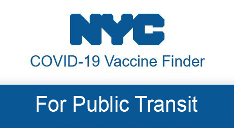

# NYC COVID-19 Vaccine Finder

## Background
Vaccination is the primary preventive measure to battle against the COVID-19 pandemic. In New York City (NYC), reaching a vaccination clinic is highly reliant on public transit. This Jupyter notebook helps to locate COVID-19 vaccine resources near a public transit station (metro or bus) in NYC. 

You can access the notebook on the *CyberGISX* website: https://cybergisxhub.cigi.illinois.edu/notebook/nyc-covid-19-vaccine-finder/

## Instructions
* You need to specify a buffer distance (e.g., 2 miles) and a target public transit station ID (e.g., 500) to search and identify the COVID-19 vaccines near the station.

* The vaccination clinic data in NYC are provided. If you want to replicate the project for another study area, you need to prepare the public transit station data and census tract data for that area. Also, you need to prepare the vaccination clinic data by following one of the two options:
    - Option 1: Use a cleaned clinic data (*.csv*) for that study area.
    - Option 2: Webscrape the vaccination location data and geocode the data for that study area. Please refer to the following notebooks for Option 2.

      **Webscraping HTML**: https://cybergisxhub.cigi.illinois.edu/notebook/covid-19-webscraper/
      
      **Data Geocoder**: https://cybergisxhub.cigi.illinois.edu/notebook/covid-19-vaccine-geocoder/

## Data
* NYC COVID-19 vaccination clinics: [NYC COVID-19 and Flu Vaccine Finder](https://vaccinefinder.nyc.gov/) as of January 13, 2022.
* NYC bus stations: [NYC Open Data](https://data.cityofnewyork.us/Transportation/Bus-Stop-Shelters/qafz-7myz).
* NYC metro stations: [NYC Open Data](https://data.cityofnewyork.us/Transportation/Subway-Stations/arq3-7z49).
* NYC census tracts: [NYC Open Data](https://data.cityofnewyork.us/City-Government/2010-Census-Tracts/fxpq-c8ku). 

## Contact Information
Please contact Yunhe Cui (yunhe.cui@uconn.edu) for technical support or Peter Chen (peter.chen@uconn.edu) for other questions.
